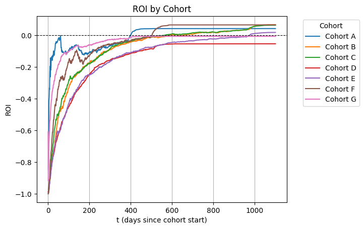
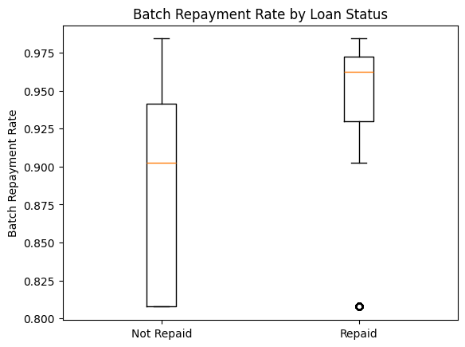
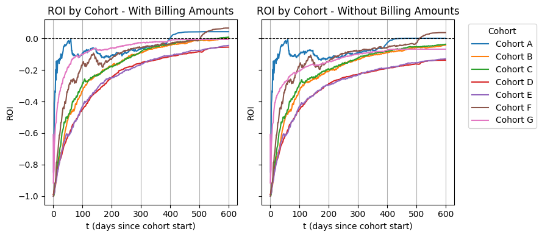
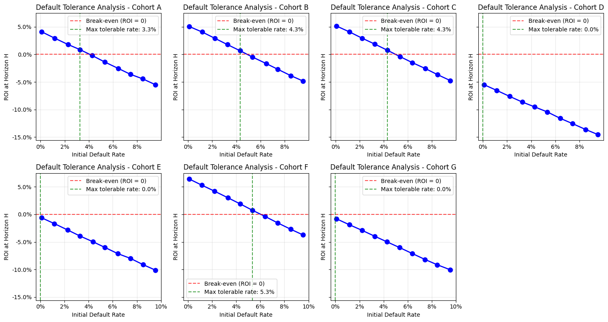
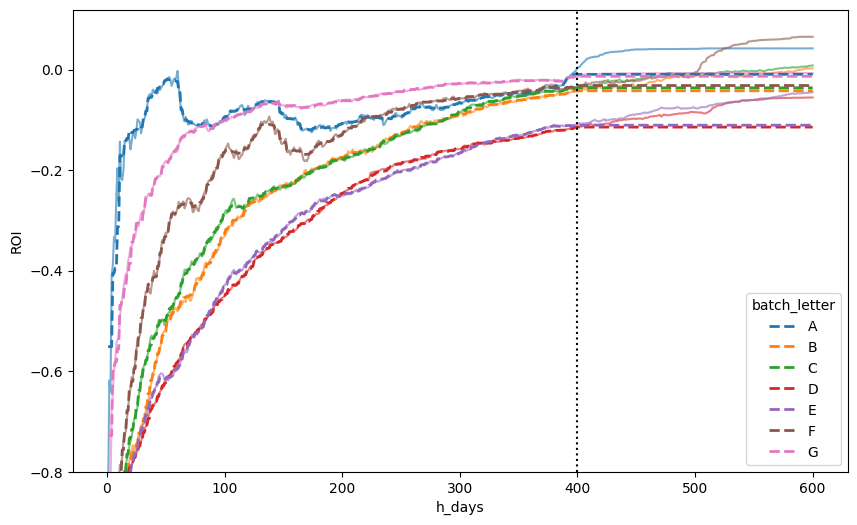

# Cohort Profitability Prediction: Analysis Report

## Executive Summary

This report presents the findings from a comprehensive analysis aimed at predicting cohort profitability for loan portfolios. The goal was to develop a model that could predict Return on Investment (ROI) at a future time horizon using only information available at an early decision time. **While significant progress was made in understanding the data and developing sophisticated modeling approaches, the final predictive model did not achieve the desired performance levels.**

The analysis revealed fundamental challenges in extrapolating time series behavior beyond the training data range, particularly with tree-based models, leading to exploration of hybrid modeling approaches combining linear trend modeling with machine learning techniques.

## Problem Statement and Methodology

### Business Context
The challenge involved predicting cohort-level ROI at a time horizon of 600 days using only information available up to 400 days after cohort creation. This early prediction capability would enable better portfolio management and risk assessment decisions.

### Mathematical Framework
ROI for cohort *c* at time *t* was defined as:

$$
\text{ROI}_c(t) = \frac{R_c(t)}{L_c(t)} - 1
$$

Where:
- $R_c(t)$: cumulative repayments up to time $t$
- $L_c(t)$: total loan exposure at time $t$



### Data Overview
- **7 cohorts** analyzed with varying characteristics
- **45,381 unique loans** across all cohorts
- **Time range**: 1000+ days of observation data
- **Decision time**: 400 days (for feature extraction)
- **Prediction horizon**: 600 days

## Key Findings

### 1. Data Patterns and Insights

#### ROI Curve Behavior
The analysis revealed that cohort ROI curves follow an **exponential decay pattern** toward a plateau:

$$
Y(t) = Y_p + (Y_0 - Y_p) e^{-kt}
$$

Where:
- $Y_p$: plateau ROI value
- $Y_0$: initial ROI ($-1.0$, representing full loan exposure)
- $k$: decay constant
- $t$: time in days

**Key profitability findings**:
- **5 out of 7 cohorts** achieved profitability (A, B, C, E, F)
- **4 cohorts** became profitable after 400-600 days (A, B, C, F)
- **Cohort E** required ~1000 days to achieve profitability
- **Cohorts D and G** remained unprofitable throughout the observation period

#### Cohort Heterogeneity and Risk Profiles
Significant variation was observed across cohorts:

**Portfolio Characteristics**:
- **Portfolio sizes**: 11K to 50K loans per cohort
- **Total exposure**: $2.7M to $114.6M per cohort
- **Interest rates**: 2.06% to 3.40% average by cohort

### 2. Feature Engineering Results

A comprehensive feature engineering process created **44 features** across two levels:

#### Loan-Level Features (27 features)
- **Loan characteristics**: Amount, interest rate, temporal features
- **Early repayment behavior**: Velocity, consistency, ROI at 30/60/90 days  
- **Repayment quality indicators**: Relative payment amounts, billing status
- **Missing data challenge**: ~66.7% missing values for behavioral features (loans with no repayments)

#### Cohort-Level Features (17 features) 
- **Portfolio metrics**: Size, concentration (HHI)
- **Distribution statistics**: Percentiles, skewness, coefficient of variation
- **Risk indicators**: Interest rate distribution, value-weighted averages

### 2.5. Key EDA Research Questions and Findings

#### Cohort Repayment Rate and Payment Status Analysis
*Research Question*: "Do loans within the same cohort being predominantly repaid increase the chance that a particular loan will be repaid?"

- **Methodology**: Logistic regression modeling individual loan repayment probability as a function of cohort repayment rate
- **Key Finding**: Weak but significant relationship (Pseudo R² = 0.078) 
- **Statistical Evidence**: Positive coefficient indicating higher cohort repayment rates associated with higher individual repayment probability
- **Business Insight**: While cohort behavior has some influence, individual loan characteristics dominate repayment outcomes
- **Visual Evidence**: Box plot analysis showed loans that were repaid tend to belong to cohorts with higher overall repayment rates



#### Collections Sensitivity Analysis
*Research Question*: "How would changes in billing amounts affect the ROI curves?"

- **Methodology**: Comparative analysis of ROI curves with and without collection amounts
- **Key Findings**:
  - **Critical impact**: Collections have substantial effect on cohort profitability
  - **Without collections**: Only cohort F remained profitable
  - **Strong correlation**: Collections ratio negatively correlated with ROI (R² = 0.919)
  - **Statistical significance**: Higher collections ratios significantly associated with lower ROI (p = 0.012)
- **Business Insight**: Cohorts with higher dependency on collections typically indicate poor underlying loan quality and lower profitability



#### Default Tolerance Analysis 
*Research Question*: "What initial default rate can each cohort tolerate while remaining profitable?"

- **Methodology**: Stratified sampling simulation using loan amount percentiles to avoid selection bias
- **Simulation Approach**: Systematically removed loans across different default rate scenarios (0.1% to 10%)
- **Key Findings**:
  - **Profitable cohorts** showed varying tolerance levels for initial defaults
  - **Unprofitable cohorts** (D, G) had zero tolerance by definition
  - **Robustness**: Results stable across multiple random seeds (5 experiments per cohort)
  - **Non-linear relationship**: Default tolerance did not correlate strongly with final ROI (R² = 0.114, p = 0.6)
- **Business Insight**: Default tolerance varies significantly across cohorts and cannot be simply predicted from baseline ROI performance



### 3. Modeling Challenges and Approaches

#### Initial LightGBM Limitations
The first modeling approach using LightGBM Regressor revealed a **critical limitation of tree-based models**:
- **Extrapolation failure**: Models could not predict beyond the range of training data
- **Overfitting issues**: Despite hyperparameter tuning, models showed poor generalization
- **R² performance**: Achieved only low R² scores on test data beyond decision time



#### Hybrid Modeling Development
To address the extrapolation problem, a **hybrid modeling approach** was developed:

1. **Trend Component**: Linear regression on Box-Cox transformed ROI to capture long-term trends
2. **Residual Component**: LightGBM to model complex patterns in residuals
3. **Uncertainty Quantification**: Bootstrap sampling for confidence intervals

The hybrid approach showed **improved extrapolation capabilities** but still faced challenges in achieving robust predictive performance.


### 4. Uncertainty Quantification

A significant contribution of this analysis was the development of **bootstrap-based uncertainty quantification**:
- **Method**: 100 bootstrap samples for robust uncertainty estimates
- **Output**: 95% confidence intervals for all predictions
- **Coverage analysis**: Evaluation of how often true values fall within predicted intervals

## Technical Innovations

### 1. Hybrid Model Architecture
```python
class HybridROIModel:
    # Combines linear trend + tree-based residual modeling
    # Addresses extrapolation limitations of pure tree models
```

### 2. Bootstrap Uncertainty Framework
- Quantifies both aleatoric (data) and epistemic (model) uncertainty
- Provides actionable confidence intervals for business decisions
- Enables risk-aware portfolio management

### 3. Temporal Constraint Enforcement
- Strict adherence to decision time constraints in feature engineering
- Prevention of data leakage from future information
- Realistic simulation of production decision-making scenarios

## Limitations and Challenges

### 1. Model Performance
**The primary limitation of this analysis is that none of the developed models achieved satisfactory predictive performance for the business use case.** Key issues included:

- **Limited training data**: Only 7 cohorts available for model training
- **High variance**: Significant variation between cohorts made generalization difficult  
- **Extrapolation complexity**: The 200-day extrapolation period (400→600 days) proved challenging
- **Feature-target relationship**: Weak relationships between available features and future ROI

### 2. Methodological Challenges
- **Time series nature**: ROI prediction requires modeling temporal dependencies
- **Multiple scales**: Balancing loan-level and cohort-level information
- **Uncertainty estimation**: Computational complexity of bootstrap methods

### 3. Implementation Constraints
- **Loan-level modeling approach**: Due to time constraints, the comprehensive loan-level feature analysis was not implemented. While 27 loan-level features were engineered and documented, the alternative modeling strategy of predicting individual loan outcomes and aggregating to cohort-level ROI remained unexplored. This approach could potentially have provided better insights into individual loan behavior patterns and their contribution to overall cohort profitability.

## Lessons Learned

### 1. Modeling Insights
- **Tree-based limitations**: Pure gradient boosting models cannot extrapolate trends
- **Hybrid approaches**: Combining linear and non-linear models shows promise
- **Uncertainty is crucial**: Business decisions require confidence intervals, not just point estimates

### 3. Alternative Approaches
- **Survival analysis**: Modeling time-to-full-repayment could provide different insights
- **Ensemble methods**: Combining multiple model types might improve robustness
- **Deep learning**: Recurrent neural networks could better capture temporal patterns

## Technical Implementation

### Code Organization
The analysis produced a well-structured codebase:

```
src/
├── models/
│   ├── hybrid_roi_model.py      # Main hybrid model implementation
│   ├── visualization.py         # Plotting utilities
│   └── example_usage.py         # Usage demonstrations
├── features/
│   ├── cohort_features.py       # Cohort-level feature engineering
│   └── loan_features.py         # Loan-level feature engineering
└── dataset/
    └── data_manipulation.py     # Data loading and processing
```

### Project Setup and Environment

This project was built using **uv**, a modern Python package manager that provides fast and reliable dependency management. The project follows modern Python packaging standards with all dependencies explicitly declared in the `pyproject.toml` file.

#### Replicating the Environment

To replicate the analysis environment:

1. **Install uv** (if not already installed):
   ```bash
   # On Windows
   powershell -c "irm https://astral.sh/uv/install.ps1 | iex"
   
   # On macOS/Linux
   curl -LsSf https://astral.sh/uv/install.sh | sh
   ```

<!-- 2. **Clone the repository**:
   ```bash
   git clone <repository-url>
   cd case-ds-cloud-walk
   ``` -->

2. **Create and activate virtual environment**:
   ```bash
   # uv automatically creates a virtual environment and installs dependencies
   uv sync
   ```

3. **Run analysis notebooks**:
   ```bash
   # Start Jupyter
   uv run jupyter lab
   ```
   You also can attach the virtual environment kernel to VSCode notebooks for direct execution.

#### Dependencies
All project dependencies are declared in `pyproject.toml`, including:
- **Data processing**: pandas, numpy, scipy
- **Machine learning**: scikit-learn, lightgbm, prophet
- **Visualization**: matplotlib, seaborn, plotly
- **Database**: sqlite3 (built-in)
- **Development**: jupyter, ipython

The uv lock file (`uv.lock`) ensures reproducible installations across different environments.

### Reproducibility
- All analysis code is version-controlled and documented
- Random seeds fixed for reproducible results
- Configuration parameters centralized for easy modification
- Exact dependency versions locked in `uv.lock` for consistent environments

## Conclusion

This analysis represents a thorough exploration of cohort profitability prediction, advancing understanding of the challenges involved in financial time series forecasting. **While the ultimate goal of creating a production-ready predictive model was not achieved, significant progress was made in:**

1. **Problem formulation**: Clear mathematical framework for ROI prediction
2. **Feature engineering**: Comprehensive feature set respecting temporal constraints
3. **Modeling innovation**: Development of hybrid approaches addressing tree model limitations
4. **Uncertainty quantification**: Bootstrap-based confidence interval estimation
5. **Technical infrastructure**: Reusable, well-documented codebase

The analysis highlights the inherent difficulty of early-stage profitability prediction in lending portfolios and provides a foundation for future work with expanded datasets and alternative methodological approaches.

### Future Work
1. **Data collection**: Gather more cohorts and longer observation periods
2. **External features**: Incorporate macroeconomic and market indicators
3. **Alternative targets**: Explore different prediction objectives (default rates, loss rates)
4. **Advanced methods**: Investigate deep learning and survival analysis approaches
5. **Production deployment**: Develop real-time prediction system with uncertainty bounds